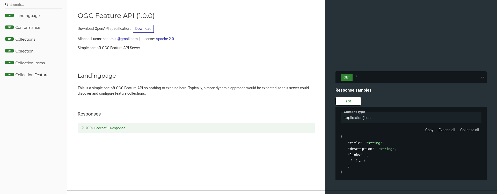

# Prototype Project

This project is a rough prototype which provides the scaffolding for an OGC Feature API v1.0 
utilizing the FastAPI framework. 

## How it works

To configure a __Feature__ class utilized the decorator provided in the `app.collection` module and extent
the abstract `FeatureDataProvider` class.

### Example

```python
@feature_collection(collection_id='tc-location',
                    title='Tropical Cyclone Locations',
                    description='The location points for tropical cyclones',
                    spatial_extent=(-180, -68.5, 180, 83.01000),
                    temporal_extent=(
                            datetime.fromisoformat('1842-10-25 03:00:00.000000'),
                            datetime.fromisoformat('2023-06-16 12:00:00.000000')
                    ))
class TCLocation(FeatureDataProvider):

    def _map_feature_to_geojson(self, feature: Row) -> Dict[str, Any]:
        # there are tools for this but currently this a prototype project so some janky stuff for now
        # todo: Model features rather then brute forcing the issue.
        geom = from_wkt(feature[4])
        return {
            'type': 'Feature',
            'geometry': {
                'type': 'Point',  # not very dynamic?
                'coordinates': get_coordinates(geom).tolist()
            },
            'properties': {
                'id': feature[0],
                'sid': feature[1],
                'name': feature[2],
                'iso_time': feature[3]
            }
        }

    def _sql_for_items_query(self) -> TextClause:
        return text("""
        select id,
               sid,
               name, 
               iso_time,
               st_astext(geom) as geom
        from storm_location
        limit 25
        """)

    def _sql_for_item_query(self) -> TextClause:
        return text("""
        select id,
               sid,
               name,
               iso_time,
               st_astext(geom) geom
        from storm_location
        where sid = :feature_id
        """)
```

The above example you can see that the `@feature_collection` decorator provides the necessary metadata
to describe the collection. Then the `_sql_for_items_query` and `_sql_for_item_query` method uses 
to provide the `TextClause` to retrieve the data from the database. Then finally each of the `Row` are converted to a 
dictionary using the `_map_feature_to_geojson`.

In short, the decorator is the configuration and the class is the adapter to retrieve the data. Given enough time each
of the `FeatureDataProvider` should have an ORM which would provide the necessary data conversion to/from the database.
In fact, the `FeatureDataProvider` has generic largely unused at this point to type the modeled results.

## What needs to be done

- Provide a mechanism to allow multiple datasource, rather than one global datasource
- Pagination for the /collections/{collection_id}/items endpoint
- Model the results for the `@feature_collection` decorated classes to convert the data from the database into a 
value GeoJSON response
- ~~Configuration to define modules with `@feature_collections` so they are discovered and configured when the app starts~~
- Finish unit tests
- Document the code
- And much more...

> The apps module `__init__.py` imports the `app.features` module if additional features are added that module to should
> be added to the root or its `__init__.py` to preload (discover) the decorated `FeatureDataProvider` classes.

### Example Output

#### Landing Page (/)

```json
{
  "title": "OGC Feature API",
  "description": "Simple one-off OGC Feature API Server",
  "links": [
    {
      "href": "http://127.0.0.1:8000/docs",
      "rel": "service-doc",
      "type": "text/html",
      "title": "The Swagger UI for this API"
    },
    {
      "href": "http://127.0.0.1:8000/redoc",
      "rel": "alternate",
      "type": "text/html",
      "title": "The ReDoc UI for this API"
    },
    {
      "href": "http://127.0.0.1:8000/openapi.json",
      "rel": "service-desc",
      "type": "application/json",
      "title": "The OpenAPI JSON definition"
    },
    {
      "href": "http://127.0.0.1:8000/conformance",
      "rel": "conformance",
      "type": "application/json"
    },
    {
      "href": "http://127.0.0.1:8000/collections",
      "rel": "data"
    },
    {
      "href": "http://127.0.0.1:8000/",
      "rel": "self",
      "type": "application/json"
    }
  ]
}
```


The Swagger UI generated by FastAPI's app, route, and model decorators (some inferred) found using the `rel="alternative"`
link.


The ReDoc UI generated by FastAPI's app, route, and model decorates (some inferred). Since the OGC responses are nearly 
like Collections+JSON HATEOAS format they provide nice discoverable linked data. 



#### Conformance (/conformance)

> **IMPORTANT**: This isn't true or at least the current state does not conform to these standards. Once the app is 
> finished and the unit testing is completed per the OGC Feature API requirements; This will be so...

```json
{
  "conformsTo": [
    "http://www.opengis.net/spec/ogcapi-features-1/1.0/req/core",
    "http://www.opengis.net/spec/ogcapi-features-1/1.0/conf/geojson",
    "http://www.opengis.net/spec/ogcapi-features-1/1.0/conf/html",
    "http://www.opengis.net/spec/ogcapi-features-1/1.0/conf/oas30"
  ]
}
```

#### Collections (/collections)

> Much more testing is needed for the extent, as you see it is keyed wrong, one to many extents. That is where those 
> unit test come in handy. That bug would never get by, with proper unit testing. 

```json
{
  "links": [
    {
      "href": "http://127.0.0.1:8000/collections/tc-location",
      "rel": "collection",
      "title": ""
    },
    {
      "href": "http://127.0.0.1:8000/collections/tc-track",
      "rel": "collection",
      "title": ""
    }
  ],
  "collections": [
    {
      "id": "tc-location",
      "title": "Tropical Cyclone Locations",
      "description": "The location points for tropical cyclones",
      "extent": {
        "extent": {
          "spatial": [
            [
              -180,
              -68.5,
              180,
              83.01
            ]
          ],
          "temporal": [
            [
              "1842-10-25T03:00:00",
              "2023-06-16T12:00:00"
            ]
          ]
        }
      },
      "itemType": "feature",
      "links": [
        {
          "href": "http://127.0.0.1:8000/collections/tc-location",
          "rel": "self",
          "type": "application/json",
          "title": "Tropical Cyclone Locations"
        },
        {
          "href": "http://127.0.0.1:8000/collections/tc-location/items",
          "rel": "items",
          "type": "application/json",
          "title": "Tropical Cyclone Locations Items"
        }
      ]
    },
    {
      "id": "tc-track",
      "title": "Tropical Cyclone Tracks",
      "description": "The storm track (connecting the dots)",
      "extent": {
        "extent": {
          "spatial": [
            [
              -180,
              -68.5,
              180,
              83.01
            ]
          ],
          "temporal": [
            [
              "1842-10-25T03:00:00",
              "2023-06-16T12:00:00"
            ]
          ]
        }
      },
      "itemType": "feature",
      "links": [
        {
          "href": "http://127.0.0.1:8000/collections/tc-track",
          "rel": "self",
          "type": "application/json",
          "title": "Tropical Cyclone Tracks"
        },
        {
          "href": "http://127.0.0.1:8000/collections/tc-track/items",
          "rel": "items",
          "type": "application/json",
          "title": "Tropical Cyclone Tracks Items"
        }
      ]
    }
  ]
}
```

#### Collection Items (/collections/{collection_id}/items)

> Not valid GeoJSON still need a lot of work. Example is only a subset of 4 features for brevity.

```json
{
  "type": "FeatureCollection",
  "features": [
    {
      "type": "Feature",
      "geometry": {
        "type": "Point",
        "coordinates": [
          [
            80.30000305175781,
            10.899999618530273
          ]
        ]
      },
      "properties": {
        "id": 1,
        "sid": "1842298N11080",
        "name": "NOT_NAMED",
        "iso_time": "1842-10-25T03:00:00"
      }
    },
    {
      "type": "Feature",
      "geometry": {
        "type": "Point",
        "coordinates": [
          [
            79.83000183105469,
            10.869999885559082
          ]
        ]
      },
      "properties": {
        "id": 2,
        "sid": "1842298N11080",
        "name": "NOT_NAMED",
        "iso_time": "1842-10-25T06:00:00"
      }
    },
    {
      "type": "Feature",
      "geometry": {
        "type": "Point",
        "coordinates": [
          [
            79.3499984741211,
            10.84000015258789
          ]
        ]
      },
      "properties": {
        "id": 3,
        "sid": "1842298N11080",
        "name": "NOT_NAMED",
        "iso_time": "1842-10-25T09:00:00"
      }
    },
    {
      "type": "Feature",
      "geometry": {
        "type": "Point",
        "coordinates": [
          [
            78.87999725341797,
            10.819999694824219
          ]
        ]
      },
      "properties": {
        "id": 4,
        "sid": "1842298N11080",
        "name": "NOT_NAMED",
        "iso_time": "1842-10-25T12:00:00"
      }
    }
  ]
}
```

#### Collection Item Endpoint (/collections/{collection_id}/items/{feature_id})

```json
{
  "type": "Feature",
  "geometry": {
    "type": "Point",
    "coordinates": [
      [
        80.30000305175781,
        10.899999618530273
      ]
    ]
  },
  "properties": {
    "id": 1,
    "sid": "1842298N11080",
    "name": "NOT_NAMED",
    "iso_time": "1842-10-25T03:00:00"
  }
}
```

## Docker

> **NOTE**: This is a BYBD (Bring Your Own Database) at least for now. If time permits I'll include the instructions to build the 
> database in a container. 

```shell
$ docker-compose up --build
```

or if you prefer podman (as I do)

```shell
$ podman-compose up --build
```

